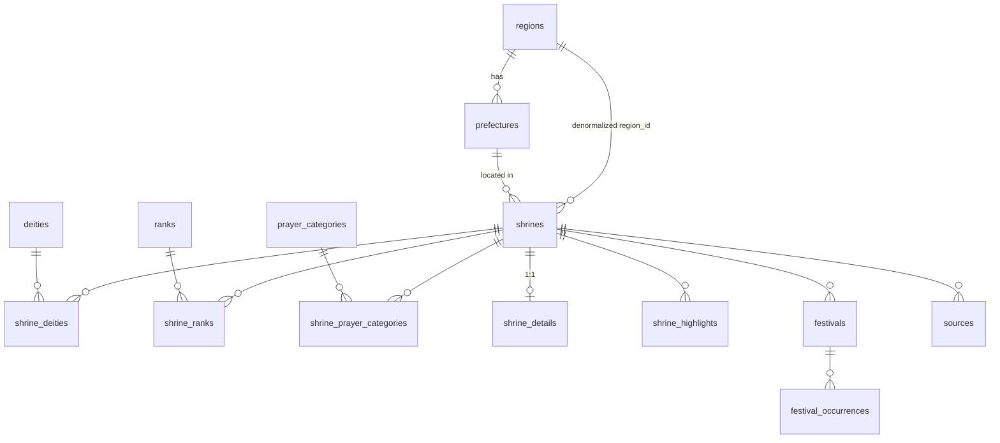

# Data Model

Reference for Jinja Meguri's database and the typed layers built on top of it.
The authoritative DDL is [`schema.sql`](./schema.sql) (schema **v3**); catalogs are
seeded by `seed.sql`; the TypeScript mirror lives in [`../lib/types.ts`](../lib/types.ts).
A visual ERD is in [`erd.html`](./erd.html). For project-wide context see
[`PROJECT_SPEC.md`](./PROJECT_SPEC.md) §4–5.

Each table below lists every column with its **Type**, whether it is **Nullable**, its
**Constraints** (PK, UNIQUE, CHECK, foreign keys, defaults), and a plain-language
**Description**. Allowed values for `CHECK` enum columns are listed in a note beneath the table.

---

## 1. Overview

PostgreSQL on Neon. **13 base tables** in the cached content graph, plus two **per-user**
tables (`user_shrine_marks`, §6.5; `user_profile`, §6.6). No views, no materialized views, no PostGIS.
The model separates three concerns:

- **Controlled vocabulary** (catalogs) — `regions`, `prefectures`, `ranks`, `prayer_categories`.
- **Core entities** — `shrines`, `deities`.
- **Relationships & detail** — junctions, 1:1 prose, festivals, occurrences, sources.

The 13 content tables make up the cached global `Store` (`loadStore()`). `user_shrine_marks`
and `user_profile` are **personal** data and live outside the `Store` — read on a separate
non-cached path (`lib/db/userRepo.ts`), keyed by the signed-in user (§6.5, §6.6, §9).

Authorization uses the Neon Auth user role, not an application table (see §7).

**Naming conventions**

- Catalog table = bare plural noun (`ranks`, `prayer_categories`, `deities`).
- Junction table = `shrine_` + that noun (`shrine_ranks`, `shrine_prayer_categories`, `shrine_deities`).
- `name_en` = romaji / English; `name_ja` = kanji/kana (preserved everywhere).

**Design principles**

- **Queryable attributes are never buried in prose.** Filters operate on tagged junction rows
  (`shrine_ranks`, `shrine_prayer_categories`, `shrine_deities`), never on free-text columns.
- **Deities are canonical** — one row per kami, deduped on `name_ja`. Shrine-specific lore lives
  on the `shrine_deities` junction, not on the deity.
- **Ranks are many-to-many.** All ranks are stored as rows; "highest rank" is derived as
  `MIN(rank_order)` at query time, not stored.
- **Display strings are separate from query data.** A festival's `time_prose`
  ("dawn, 2nd Sunday of May") is for display; dated `festival_occurrences` drive range queries.

---

## 2. Entity-relationship diagram



The content graph above has no auth tables — authorization is the Neon Auth user role (§7).

---

## 3. Catalog tables (controlled vocabulary)

Seeded by `seed.sql`; rarely change. Use `smallint` identity PKs.

### `regions`
8 traditional regions of Japan.

| Column    | Type       | Nullable | Constraints            | Description                      |
| --------- | ---------- | -------- | ---------------------- | -------------------------------- |
| `id`      | `smallint` | No       | PK, generated identity | Surrogate key.                   |
| `name_en` | `text`     | No       | UNIQUE                 | Region name in romaji / English. |
| `name_ja` | `text`     | Yes      | —                      | Region name in kanji.            |

### `prefectures`
47 prefectures, each mapped to a region (Mie placed in Kinki).

| Column      | Type       | Nullable | Constraints            | Description                          |
| ----------- | ---------- | -------- | ---------------------- | ------------------------------------ |
| `id`        | `smallint` | No       | PK, generated identity | Surrogate key.                       |
| `name_en`   | `text`     | No       | UNIQUE                 | Prefecture name in romaji / English. |
| `name_ja`   | `text`     | Yes      | —                      | Prefecture name in kanji.            |
| `region_id` | `smallint` | No       | → `regions(id)`        | Region this prefecture belongs to.   |

### `ranks`
Consolidated cross-system shrine-rank list (classical, modern *shakaku*, post-1946 *Beppyō*).

| Column        | Type       | Nullable | Constraints            | Description                                              |
| ------------- | ---------- | -------- | ---------------------- | -------------------------------------------------------- |
| `id`          | `smallint` | No       | PK, generated identity | Surrogate key.                                           |
| `name_en`     | `text`     | No       | UNIQUE                 | Romaji rank name ('Ichinomiya', 'Sonsha', …).            |
| `description` | `text`     | Yes      | —                      | English translation / label for the rank.               |
| `name_ja`     | `text`     | Yes      | —                      | Rank name in kanji.                                      |
| `rank_order`  | `smallint` | No       | —                      | Prestige order; **1 = highest**. Drives "highest rank".  |

`Honso` (本宗, order 0) is unique to Ise Jingū; `Sohonsha` (総本社, order 1) is the head of a network.

### `prayer_categories`
25 *goriyaku* ("strong for"), grouped into 7 labels. Powers the listing facet filter.

| Column        | Type       | Nullable | Constraints            | Description                                       |
| ------------- | ---------- | -------- | ---------------------- | ------------------------------------------------- |
| `id`          | `smallint` | No       | PK, generated identity | Surrogate key.                                    |
| `name_en`     | `text`     | No       | UNIQUE                 | Goriyaku name in romaji / English.                |
| `name_ja`     | `text`     | Yes      | —                      | Goriyaku name in kanji.                           |
| `group_label` | `text`     | No       | —                      | Display grouping, e.g. "Love & Family", "Health". |

---

## 4. Core entities

### `deities`
Canonical, one row per kami. Deduped on `name_ja` at ingest.

| Column           | Type     | Nullable | Constraints             | Description                                                             |
| ---------------- | -------- | -------- | ----------------------- | ----------------------------------------------------------------------- |
| `id`             | `uuid`   | No       | PK, `gen_random_uuid()` | Surrogate key.                                                          |
| `name_en`        | `text`   | No       | —                       | Romaji / English name.                                                 |
| `name_ja`        | `text`   | Yes      | UNIQUE                  | Kanji name; the **dedup key** on ingest.                               |
| `titles`         | `text[]` | Yes      | —                       | Domain/role epithets (sphere of patronage); empty for primordial kami. |
| `deity_type`     | `text`   | No       | CHECK (enum)            | Current official status only (not historical syncretism).              |
| `canonical_lore` | `text`   | Yes      | —                       | Kojiki/Nihon Shoki narrative.                                          |
| `mythic_sphere`  | `text`   | Yes      | —                       | Free-text domain label shown in the deity card (e.g. "Agriculture & Commerce"). |

> `deity_type` ∈ `mythological` | `deified_human` | `syncretic`.

- `deity_type` = **current official status only**. Historical syncretism (e.g. Gozu Tennō ↔ Susanoo)
  belongs in lore fields, never in the type.
- Collective deity groups (e.g. 八柱御子神) are stored as a single row by convention.

### `shrines`
The central entity.

| Column          | Type               | Nullable | Constraints             | Description                                              |
| --------------- | ------------------ | -------- | ----------------------- | ------------------------------------------------------- |
| `id`            | `uuid`             | No       | PK, `gen_random_uuid()` | Surrogate key.                                          |
| `slug`          | `text`             | No       | UNIQUE                  | URL key for detail-page routing.                       |
| `name_en`       | `text`             | No       | —                       | Shrine name in romaji / English.                       |
| `name_ja`       | `text`             | Yes      | —                       | Shrine name in kanji.                                  |
| `prefecture_id` | `smallint`         | No       | → `prefectures(id)`     | Prefecture the shrine is located in.                  |
| `region_id`     | `smallint`         | No       | → `regions(id)`         | **Denormalized** region (derivable from prefecture) for cheap filtering. |
| `city`          | `text`             | Yes      | —                       | City / town.                                          |
| `address`       | `text`             | Yes      | —                       | Full street address.                                  |
| `lat`           | `double precision` | Yes      | —                       | WGS-84 latitude (plain column, **not** PostGIS).      |
| `lng`           | `double precision` | Yes      | —                       | WGS-84 longitude.                                     |
| `image_urls`    | `text[]`           | Yes      | —                       | External image URLs.                                  |
| `created_at`    | `timestamptz`      | No       | DEFAULT `now()`         | Row creation timestamp.                               |
| `updated_at`    | `timestamptz`      | No       | DEFAULT `now()`         | Last-modified timestamp.                              |

Indexes: `idx_shrines_prefecture`, `idx_shrines_region`.

> Note: in TypeScript, `lat`/`lng` are folded into a `coordinates: { lat, lng } | null`
> object on `ShrineRow` (see [`lib/types.ts`](../lib/types.ts)), but the DB stores two columns.

---

## 5. Junction tables

### `shrine_deities`
Shrine ↔ deity, carrying shrine-specific deity data.

| Column          | Type       | Nullable | Constraints                           | Description                                                  |
| --------------- | ---------- | -------- | ------------------------------------- | ----------------------------------------------------------- |
| `shrine_id`     | `uuid`     | No       | PK, → `shrines(id)` ON DELETE CASCADE | Shrine side of the link.                                    |
| `deity_id`      | `uuid`     | No       | PK, → `deities(id)`                   | Deity side of the link.                                     |
| `is_primary`    | `boolean`  | No       | DEFAULT false                         | Whether this is the shrine's main enshrined kami.           |
| `sort_order`    | `smallint` | No       | DEFAULT 0                             | Display order of deities on the shrine.                     |
| `regional_lore` | `text`     | Yes      | —                                     | Shrine or region-specific lore; `null` if the shrine use canonical lore.|
| `alter_name_en` | `text`     | Yes      | —                                     | Shrine-specific alternate (enshrined) romaji name; `null` = use `deities.name_en`.|
| `alter_name_ja` | `text`     | Yes      | —                                     | Shrine-specific alternate (enshrined) kanji name; `null` = use `deities.name_ja`.|
| `alter_titles`  | `text[]`   | Yes      | —                                     | Shrine-specific title/epithet override; `null` = use `deities.titles`.|

PK `(shrine_id, deity_id)`. Index `idx_shrine_deities_deity`.
The UI shows the primary deity's `canonical_lore` (with `regional_lore` as a supplementary note)
and `regional_lore` for secondary deities. When `alter_name_en`/`alter_name_ja` are set, the shrine
detail/modal display **leads with the alternate (enshrined) name** and shows the canonical deity
name as a subtitle ("Enshrined form of …") — lore always comes canonically from `deities`, but
**titles follow `alter_titles ?? deities.titles`**: a shrine can override how a deity's epithets read
for that enshrinement (e.g. a different sphere of patronage locally) without touching the global
deity record other shrines link to. These alternate fields are part of the `DeityView` view model
assembled in `lib/db/repo.ts`.

### `shrine_ranks`
Shrine ↔ rank. All applicable ranks stored as rows.

| Column      | Type       | Nullable | Constraints                           | Description                |
| ----------- | ---------- | -------- | ------------------------------------- | -------------------------- |
| `shrine_id` | `uuid`     | No       | PK, → `shrines(id)` ON DELETE CASCADE | Shrine side of the link.   |
| `rank_id`   | `smallint` | No       | PK, → `ranks(id)`                     | A rank held by the shrine. |

PK `(shrine_id, rank_id)`. "Highest rank" = `MIN(rank_order)` joined to `ranks` at query time.

### `shrine_prayer_categories`
Shrine ↔ prayer category. Powers the "strong for" facet filter.

| Column        | Type       | Nullable | Constraints                           | Description                             |
| ------------- | ---------- | -------- | ------------------------------------- | --------------------------------------- |
| `shrine_id`   | `uuid`     | No       | PK, → `shrines(id)` ON DELETE CASCADE | Shrine side of the link.                |
| `category_id` | `smallint` | No       | PK, → `prayer_categories(id)`         | A prayer category tagged on the shrine. |

PK `(shrine_id, category_id)`. Index `idx_shrine_prayer_categories_cat`.

---

## 6. Detail, festivals & provenance

### `shrine_details` (1:1 prose)
One row per shrine; topical narrative prose.

| Column         | Type   | Nullable | Constraints                               | Description                                     |
| -------------- | ------ | -------- | ----------------------------------------- | ----------------------------------------------- |
| `shrine_id`         | `uuid` | No       | **PK**, → `shrines(id)` ON DELETE CASCADE | Owning shrine (1:1).                            |
| `history`           | `text` | Yes      | —                                         | Founding, legendary events, syncretic layers.  |
| `description`       | `text` | Yes      | —                                         | Significance, unique fact + visitor experience (why visit).  |
| `prayer_focus`      | `text` | Yes      | —                                         | Primary purposes pilgrims pray for - with JP terms.                 |
| `best_time`         | `text` | Yes      | —                                         | Nature / atmosphere / timing.                  |
| `quote`             | `text` | Yes      | —                                         | Short 1–2 sentence quote about the shrine (rendered as the detail-view epigraph). |
| `geographic_notes`  | `text` | Yes      | —                                         | Natural setting, landscape, terrain, and access notes shown in the Transit & Geography section. |

### `shrine_highlights` (1:N "don't-miss" points of interest)
Scannable list of concrete on-site features a visitor can walk up to or do (sacred trees, a unique
omikuji custom, a signature torii). Rendered under `description` in Chapter I (Sanctuary Portrait).
Intentionally **may overlap** the `description` prose — no deduplication.

| Column       | Type   | Nullable | Constraints                          | Description                                                  |
| ------------ | ------ | -------- | ------------------------------------ | ----------------------------------------------------------- |
| `id`         | `uuid` | No       | PK, `gen_random_uuid()`              | Surrogate key.                                              |
| `shrine_id`  | `uuid` | No       | → `shrines(id)` ON DELETE CASCADE    | Owning shrine.                                              |
| `title`      | `text` | No       | —                                    | Feature name, English first with kanji in parens.           |
| `body`       | `text` | Yes      | —                                    | One short gloss line; `null` for a title-only highlight.    |
| `sort_order` | `int`  | No       | DEFAULT 0                            | Display order (set from the editor's array index).         |

Index `idx_shrine_highlights_shrine` on `(shrine_id, sort_order)`. Delete-and-reinsert on every
`upsertShrine` (no stable identity needed). Read via `getShrineDetail` into `ShrineDetail.highlights`
(`{ title, body }[]`, ordered by `sort_order`).

### `festivals` (definition + optional dated occurrence)

| Column          | Type   | Nullable | Constraints                                | Description                                                    |
| --------------- | ------ | -------- | ------------------------------------------ | -------------------------------------------------------------- |
| `id`            | `uuid` | No       | PK, `gen_random_uuid()`                    | Surrogate key.                                                |
| `shrine_id`     | `uuid` | No       | → `shrines(id)` ON DELETE CASCADE          | Owning shrine.                                                |
| `name_en`       | `text` | No       | —                                          | Festival name in romaji / English.                           |
| `name_ja`       | `text` | Yes      | —                                          | Festival name in kanji.                                       |
| `time_prose`    | `text` | Yes      | —                                          | Display label for timing, cycle ('dawn, 2nd Sunday of May', lunar…). |
| `start_date`    | `date` | Yes      | —                                          | Structured start date; `null` if undated.                    |
| `end_date`      | `date` | Yes      | —                                          | Structured end date; `null` if undated.                      |
| `origin`        | `text` | Yes      | —                                          | Historical cause, crisis, myth, or founding moment.          |
| `meaning`       | `text` | Yes      | —                                          | Cultural / religious meaning to the deity and community.     |
| `ritual`        | `text` | Yes      | —                                          | Description of the ritual(s). Concrete actions, ceremonies, sequence of events, performances.|
| `prayer`        | `text` | Yes      | —                                          | What participants hope for. The specific human need or aspiration the event addresses.  |
| `festival_type` | `text` | Yes      | CHECK (enum)                               | Visitor access / experience type.                            |
| `visitor_notes` | `text` | Yes      | —                                          | Practical notes/ guidance for visitors.                      |
| `sort_order`    | `int`  | No       | DEFAULT 0                                  | Display order within a shrine; set to the array index at upsert time. |

> `festival_type` ∈ `spectacle` | `pilgrimage`.

Index `idx_festivals_shrine (shrine_id, sort_order)`. UNIQUE `(shrine_id, name_en)`. The festival row holds the definition and,
for fixed-Gregorian events, its own (year-agnostic) default dates; lunar / "Nth-weekday" events leave
dates null and rely on `festival_occurrences`. The UNIQUE constraint gives festivals a **stable identity**:
`upsertShrine` upserts festivals by `(shrine_id, name_en)` rather than delete-and-reinsert, so a
festival keeps its `id` (and therefore its `festival_occurrences`) across a shrine re-import or inline
edit. Festivals absent from a re-import are deleted (their occurrences cascade); **renaming** a festival
is a new identity and drops the old one's occurrences.

### `festival_occurrences` (yearly exact dates)
Concrete dated instances for festivals that can't be computed (lunar, Nth-weekday). Added manually each January.

| Column        | Type       | Nullable | Constraints                       | Description                            |
| ------------- | ---------- | -------- | --------------------------------- | -------------------------------------- |
| `id`          | `uuid`     | No       | PK, `gen_random_uuid()`           | Surrogate key.                         |
| `festival_id` | `uuid`     | No       | → `festivals(id)` ON DELETE CASCADE | Festival this occurrence belongs to. |
| `year`        | `smallint` | No       | UNIQUE with `festival_id`         | Calendar year of the occurrence.       |
| `start_date`  | `date`     | No       | —                                 | Exact start date for that year.        |
| `end_date`    | `date`     | Yes      | —                                 | Exact end date for that year.          |
| `notes`       | `text`     | Yes      | —                                 | Year-specific notes.                   |

UNIQUE `(festival_id, year)`. Indexes `idx_festival_occurrences_festival`, `idx_festival_occurrences_year`.

Loaded through the data layer: each target is `{ shrine_slug, festival_name_en, occurrences: [{ year, start_date, end_date?, notes? }] }`
(a single object or an array). The festival is resolved by `(shrine_slug, festival_name_en)` — unique via
the festivals constraint above — and rows upsert on `(festival_id, year)`, so re-saving the same
(shrine, festival, year) overwrites it. Contract: `lib/admin/occurrenceContract.ts`; mutation:
`upsertOccurrences` in `lib/db/mutations.ts`; server action: `saveOccurrencesAction` in `app/admin/actions.ts`.
Example JSON: `docs/ai-research/example-festival-occurrences.json`.

**Admin UI** lives on `/calendar` (not a separate `/admin/*` route, per the inline-editing convention):
an "Admin Controls" pill → "Add / edit dates" opens `components/admin/OccurrenceModal.tsx`, which has a
form tab (shared year, add any number of shrine+festival rows via the `SearchSelect` combobox, dates
pre-fill from the existing stored occurrence for that festival+year if one exists) and a bulk JSON-import
tab. `app/calendar/page.tsx` passes `isAdmin` and — only for admins — the full `store.festival_occurrences`
as `occurrenceSeed` so the form can pre-fill for any year without an extra fetch.

### `sources` (provenance)

| Column      | Type   | Nullable | Constraints                       | Description              |
| ----------- | ------ | -------- | --------------------------------- | ------------------------ |
| `id`        | `uuid` | No       | PK, `gen_random_uuid()`           | Surrogate key.           |
| `shrine_id` | `uuid` | No       | → `shrines(id)` ON DELETE CASCADE | Owning shrine.           |
| `url`       | `text` | No       | —                                 | Citation URL.            |
| `title`     | `text` | Yes      | —                                 | Citation title / label.  |

Index `idx_sources_shrine`. Rendered as visible footnotes on the detail page.

---

## 6.5 Per-user collections (`user_shrine_marks`)

Powers the **normal-user** features: favorites ("want to visit") and the **goshuin stamp book**
(御朱印帳, "collected / visited"). One row per `(user_id, shrine_id)`; the two timestamp columns
are independent flags. A row whose two timestamps are **both null** is meaningless and is deleted
by the mutations.

| Column       | Type          | Nullable | Constraints                            | Notes                                              |
| ------------ | ------------- | -------- | -------------------------------------- | -------------------------------------------------- |
| `user_id`    | `text`        | No       | PK                                     | Neon Auth user id (`neon_auth."user".id`).         |
| `shrine_id`  | `uuid`        | No       | PK, → `shrines(id)` ON DELETE CASCADE  | The marked shrine.                                 |
| `saved_at`   | `timestamptz` | Yes      | —                                      | Non-null ⇒ favorited ("want to visit").            |
| `stamped_at` | `timestamptz` | Yes      | —                                      | Non-null ⇒ goshuin collected ("visited").          |

Index: `idx_user_shrine_marks_user` on `(user_id)`.

- **No FK to the Neon Auth user table.** `user_id` references `neon_auth."user".id` by value only —
  Neon Auth owns that table (cross-schema), so there is no enforced FK; orphan rows for a deleted
  account are harmless (and never read, since reads are scoped to the signed-in user).
- **Outside the `Store` cache.** This is per-user data, so it is **not** loaded by `loadStore()` and
  **not** invalidated by `STORE_TAG`. Reads go through `lib/db/userRepo.ts` (`loadUserMarks`, fresh
  per request); writes through `lib/db/userMutations.ts` (`setSaved`/`setStamped`), invoked by the
  server actions in `app/users/actions.ts` (guarded by `assertUser`). The pages that read it are
  `force-dynamic`, so no revalidation is needed.

---

## 6.6 Per-user profile (`user_profile`)

Holds per-account profile preferences — currently just the chosen **kamon crest** (the avatar
shown on the profile page's "Sanctuary Pass"). One row per account, created lazily on the first
crest save.

| Column    | Type   | Nullable | Constraints | Notes                                                          |
| --------- | ------ | -------- | ----------- | -------------------------------------------------------------- |
| `user_id` | `text` | No       | PK          | Neon Auth user id (`neon_auth."user".id`).                     |
| `crest`   | `text` | No       | DEFAULT `'tomoe'` | One of `CREST_IDS` (`lib/types.ts`): `tomoe`, `matsu`, `sakura`, `ume`, `kiku`, `fuji`. |

- **No FK to the Neon Auth user table** (same cross-schema reasoning as §6.5).
- **Outside the `Store` cache.** Read fresh per request via `getUserProfile` (`lib/db/userRepo.ts`),
  which falls back to `'tomoe'` when no row exists or the stored value is unknown; written via
  `setCrest` (`lib/db/userMutations.ts`), invoked by `saveCrestAction` in `app/users/actions.ts`
  (guarded by `assertUser`, validates `crest` against `CREST_IDS`). No `STORE_TAG` revalidation —
  the profile page is `force-dynamic`. The full crest definitions (SVG renderers) live in the
  client component `components/user/UserProfileClient.tsx`; their ids must stay in sync with
  `CREST_IDS`.

---

## 7. Authorization (Neon Auth role)

Authorization is a second gate after Neon Auth sign-in. **Admin is the Neon Auth user role**,
not a local table: `neon_auth.user.role === "admin"` (the `role`/`banned` columns come from the
Better Auth **admin plugin** and live in Neon Auth's managed `user` table). `getCurrentUser()` and
`getAdminEmail()` read `role` straight off the session, and `requireAdmin`/`assertAdmin` gate on it.

> **Role model.** There is no application users table — Neon Auth owns the account records,
> including the role. Any signed-in account whose role is not `admin` is a "normal user"
> (`getCurrentUser().isAdmin === false`). Self-sign-up always creates a normal-user role, so new
> accounts are never admins until promoted: `UPDATE neon_auth."user" SET role='admin' WHERE
> lower(email)=lower('…')` (or the `admin/set-role` endpoint). See [`ACCOUNTS.md`](./ACCOUNTS.md).

> **User-scoped writes.** Any signed-in account (admins included) can own personal rows in
> `user_shrine_marks` (§6.5) and `user_profile` (§6.6). These are gated by `assertUser`/`requireUser`
> (in `lib/auth/server.ts`), the user analog of `assertAdmin`/`requireAdmin` — signed-in, no role check.

> **Removed: `app_admin`.** An earlier model used a `public.app_admin` email allowlist. It has been
> dropped from the database and `schema.sql`; authorization is now entirely the Neon Auth user role.

---

## 8. Cascade & referential behavior

- Every `shrine_*` child (`shrine_deities`, `shrine_ranks`, `shrine_prayer_categories`,
  `shrine_details`, `shrine_highlights`, `festivals`, `sources`) is **`ON DELETE CASCADE`** from
  `shrines` — deleting a shrine removes all its dependent rows.
- `festival_occurrences` cascades from `festivals`.
- `shrine_deities.deity_id` → `deities(id)` is **not** cascade: a deity is canonical and shared,
  so it is not deleted when a shrine is removed.
- Catalog FKs (`region_id`, `prefecture_id`, `rank_id`, `category_id`) have no cascade —
  catalogs are stable reference data.
- `user_shrine_marks.shrine_id` → `shrines(id)` is **`ON DELETE CASCADE`**: deleting a shrine
  removes every user's marks for it. `user_id` has no FK (Neon Auth owns the account table).

---

## 9. From rows to view models

The runtime never hands raw rows to the UI. Two layers in TypeScript bridge the gap
(see [`lib/types.ts`](../lib/types.ts) and [`lib/db/repo.ts`](../lib/db/repo.ts)):

```
Neon Postgres
  └─ loadStore()  (lib/db/store.ts)   fetches all 14 tables → Store (one array per table)
       └─ repo.ts  pure functions      assemble typed view models from the Store
            └─ page.tsx                 server components pass view models to client components
```

**Row types** (`ShrineRow`, `FestivalRow`, `Deity`, …) mirror DB columns exactly and make up the
`Store`. **View models** are what the UI consumes:

| View model        | Built by (`repo.ts`)  | Purpose                                                                 |
| ----------------- | --------------------- | ----------------------------------------------------------------------- |
| `ShrineCard`      | `getShrineCards`      | Listing card; embeds facet membership (`rank_codes`, `category_codes`, `deity_ja`) so client-side filtering needs no extra lookups, plus nullable `coordinates` for the `/map` markers |
| `ShrineDetail`    | `getShrineDetail`     | Extends `ShrineCard` with deities, all ranks, prose, highlights, festivals, sources  |
| `DeityListItem`   | `getDeityList`        | Pantheon page; deity + its shrine links (deities with no links still show) |
| `CalendarFestival`| `getFestivalYear`     | Merges festival definition + that year's occurrence (or `time_prose` fallback) |
| `FacetCatalogs`   | `getFacetCatalogs`    | Filter options, restricted to values actually in use                    |
| `UserCollections` | `getUserCollections`  | **Per-user** (non-cached, `userRepo.ts`): the signed-in user's stamped + saved `ShrineCard`s for the profile dashboard, joined from `user_shrine_marks` (§6.5) |
| `UserProfile`     | `getUserProfile`      | **Per-user** (non-cached, `userRepo.ts`): the signed-in user's profile preferences (chosen crest), from `user_profile` (§6.6) |

Key derivations done in `repo.ts`, not in SQL:

- **Highest rank** — `pickHighestRankId` (min `rank_order`) flags `is_highest` on a `RankView`.
- **Primary deity** — the `shrine_deities` row with `is_primary = true`.
- **Lore fallback** — `regional_lore ?? canonical_lore` for display.
- **Enshrined-name fallback** — `alter_name_en ?? name_en` / `alter_name_ja ?? name_ja`: the shrine's
  alternate (enshrined) name is shown when present, otherwise the canonical deity name.
- **Calendar date resolution** — occurrence date wins over the festival's own date;
  `is_fallback = true` when neither exists (display `time_prose` only).

> The DB read is cached in the Next Data Cache via `unstable_cache` (tag `STORE_TAG`) so the
> assembled `Store` is reused across requests without re-querying Neon, and additionally in
> React `cache()` for per-request dedup. Admin server actions call `revalidateTag(STORE_TAG)`
> after every write, so edits appear on the next render (1-hour `revalidate` safety net for
> out-of-band changes). See [`PROJECT_SPEC.md`](./PROJECT_SPEC.md) §3.

---

## 10. Write path (where the data comes from)

Content is authored **in place** on the public surfaces (`/shrines`, `/shrines/new`, `/deities`,
`/deities/new`) — there is no ingest script, no `data/` directory, and no `/admin` JSON-import UI.
The in-place editors serialize their draft to the contract shape (`ShrineInput` / `DeityInput`).

```
Research (JA-first) → in-place editor draft (ShrineInput / DeityInput)
  → Zod validation (lib/admin/shrineContract.ts, deityContract.ts)
  → transactional upsert (lib/db/mutations.ts) → Neon
```

`mutations.ts` owns deity dedup (upsert on `name_ja`), catalog code→id resolution
(ranks, categories, region, prefecture), and idempotent re-save by `slug`.
Research prompts and worked examples live in [`ai-research/`](./ai-research/).

### Authoring order & deferred fields

1. **Deities first.** A canonical deity — including its `canonical_lore` — is created on its own in place
   on the `/deities` carousel ("+ New deity" → `/deities/new`; existing deities via the Edit control or
   `/deities?deity=<id>&edit=1`). `DEITY_RESEARCH_PROMPT.md` helps gather the content you enter in the
   fields. `canonical_lore` is gathered **only** here.
2. **Shrines next.** A shrine import links the already-existing deity by `name_ja`. Its embedded
   `deities[].canonical` block carries identity only (`name_en`, `name_ja`, `deity_type`, `titles`) and
   **no `canonical_lore`** — the deity already has it, so `SHRINE_RESEARCH_PROMPT.md` never re-gathers it.
   (If a referenced deity doesn't exist yet, the embedded block still creates it, with `canonical_lore`
   left null until edited on the deity record.) A linked (already-existing) deity's displayed titles can
   still be adjusted **for this shrine only** via the sibling `deities[].alter_titles` field (§5
   `shrine_deities.alter_titles`) — same idea as `alter_name_en`/`alter_name_ja`, it never touches the
   deity row itself. `canonical.titles` remains the field used when the embedded block is creating a
   brand-new deity (there, it *is* the canonical value, since the deity doesn't exist yet).
3. **Festival default dates are now collected at research time.** `SHRINE_RESEARCH_PROMPT.md` asks for
   `start_date` / `end_date` for festivals with **fixed Gregorian dates** (e.g. always on 15 May);
   stored as `YYYY-MM-DD` with the current year as a placeholder — only month + day matter. Lunar,
   Nth-weekday, and otherwise shifting festivals leave both fields `null` and rely on `festival_occurrences`
   instead (see the table above). The in-place create page (`/shrines/new`) also collects these via the
   `FestivalBlock`'s `DefaultDateField`.
   - They are intended as **recurring year-agnostic defaults**; the year in the stored `date` carries no
     meaning.
   - **Read path** (`resolveCalendarDates` in `lib/calendar.ts`, used by `getFestivalYear` and
     `entriesForMonth`) — **calendar only**: for the calendar's year, (1) an occurrence for **that exact
     year** wins and is used literally; (2) otherwise the festival's **default month-day is projected onto
     that year** (so a recurring default surfaces every year, and the day-grid pins it); (3) otherwise the
     festival is undated (`is_fallback`). There is **no previous-year-occurrence fallback** — a festival
     with only past occurrences and no default won't appear until its current-year occurrence (or a default)
     is added. The **shrine detail page is unchanged** — it shows the festival's own stored dates and never
     reads occurrences.

> The `canonical_lore` column + Zod contract field still exists and accepts values on import — it is
> simply not gathered by the shrine research flow. Don't remove it.

---

## Related docs

- [`schema.sql`](./schema.sql) — authoritative DDL.
- [`erd.html`](./erd.html) — visual ERD.
- [`PROJECT_SPEC.md`](./PROJECT_SPEC.md) — §4 Data Model, §5 Catalogs, §7 Pipeline.
- [`ACCOUNTS.md`](./ACCOUNTS.md) — admin auth/authorization model.
- [`../lib/types.ts`](../lib/types.ts) — row + view-model type definitions.
- [`../lib/db/repo.ts`](../lib/db/repo.ts) — view-model assembly.
