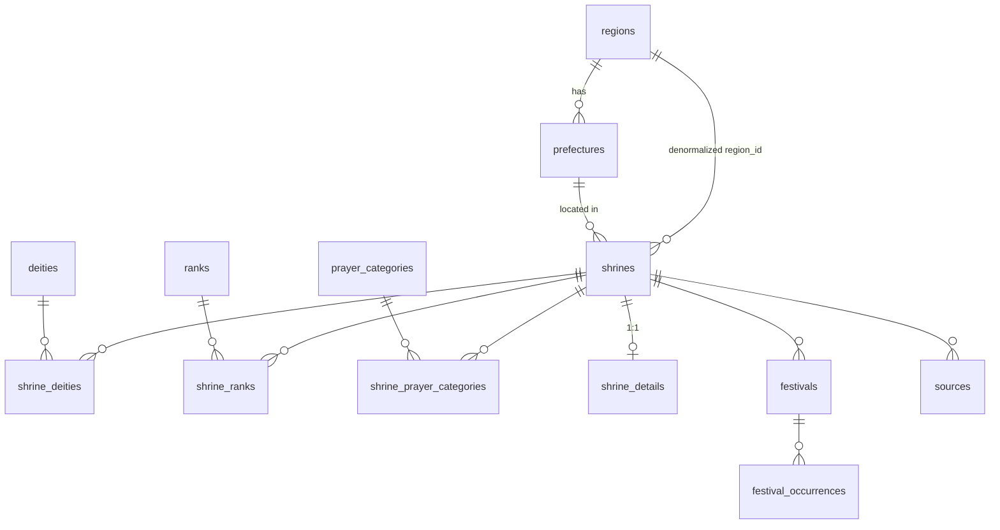

# Data Model

Reference for Jinja Meguri's database and the typed layers built on top of it.
The authoritative DDL is [`schema.sql`](./schema.sql) (schema **v3**); catalogs are
seeded by `seed.sql`; the TypeScript mirror lives in [`../lib/types.ts`](../lib/types.ts).
A visual ERD is in [`erd.html`](./erd.html). For project-wide context see
[`PROJECT_SPEC.md`](./PROJECT_SPEC.md) §4–5.

Each table below lists every column with its **Type**, whether it is **Nullable**, its
**Constraints** (PK, UNIQUE, CHECK, foreign keys, defaults), and a plain-language
**Description**. Allowed values for `CHECK` enum columns are listed in a note beneath the table.

---

## 1. Overview

PostgreSQL on Neon. **13 base tables**, no views, no materialized views, no PostGIS.
The model separates three concerns:

- **Controlled vocabulary** (catalogs) — `regions`, `prefectures`, `ranks`, `prayer_categories`.
- **Core entities** — `shrines`, `deities`.
- **Relationships & detail** — junctions, 1:1 prose, festivals, occurrences, sources.

Plus a standalone `app_admin` allowlist table for authorization.

**Naming conventions**

- Catalog table = bare plural noun (`ranks`, `prayer_categories`, `deities`).
- Junction table = `shrine_` + that noun (`shrine_ranks`, `shrine_prayer_categories`, `shrine_deities`).
- `name_en` = romaji / English; `name_ja` = kanji/kana (preserved everywhere).

**Design principles**

- **Queryable attributes are never buried in prose.** Filters operate on tagged junction rows
  (`shrine_ranks`, `shrine_prayer_categories`, `shrine_deities`), never on free-text columns.
- **Deities are canonical** — one row per kami, deduped on `name_ja`. Shrine-specific lore lives
  on the `shrine_deities` junction, not on the deity.
- **Ranks are many-to-many.** All ranks are stored as rows; "highest rank" is derived as
  `MIN(rank_order)` at query time, not stored.
- **Display strings are separate from query data.** A festival's `time_prose`
  ("dawn, 2nd Sunday of May") is for display; dated `festival_occurrences` drive range queries.

---

## 2. Entity-relationship diagram



`app_admin` stands alone (no FKs into the content graph).

---

## 3. Catalog tables (controlled vocabulary)

Seeded by `seed.sql`; rarely change. Use `smallint` identity PKs.

### `regions`
8 traditional regions of Japan.

| Column    | Type       | Nullable | Constraints            | Description                      |
| --------- | ---------- | -------- | ---------------------- | -------------------------------- |
| `id`      | `smallint` | No       | PK, generated identity | Surrogate key.                   |
| `name_en` | `text`     | No       | UNIQUE                 | Region name in romaji / English. |
| `name_ja` | `text`     | Yes      | —                      | Region name in kanji.            |

### `prefectures`
47 prefectures, each mapped to a region (Mie placed in Kinki).

| Column      | Type       | Nullable | Constraints            | Description                          |
| ----------- | ---------- | -------- | ---------------------- | ------------------------------------ |
| `id`        | `smallint` | No       | PK, generated identity | Surrogate key.                       |
| `name_en`   | `text`     | No       | UNIQUE                 | Prefecture name in romaji / English. |
| `name_ja`   | `text`     | Yes      | —                      | Prefecture name in kanji.            |
| `region_id` | `smallint` | No       | → `regions(id)`        | Region this prefecture belongs to.   |

### `ranks`
Consolidated cross-system shrine-rank list (classical, modern *shakaku*, post-1946 *Beppyō*).

| Column        | Type       | Nullable | Constraints            | Description                                              |
| ------------- | ---------- | -------- | ---------------------- | -------------------------------------------------------- |
| `id`          | `smallint` | No       | PK, generated identity | Surrogate key.                                           |
| `name_en`     | `text`     | No       | UNIQUE                 | Romaji rank name ('Ichinomiya', 'Sonsha', …).            |
| `description` | `text`     | Yes      | —                      | English translation / label for the rank.               |
| `name_ja`     | `text`     | Yes      | —                      | Rank name in kanji.                                      |
| `rank_order`  | `smallint` | No       | —                      | Prestige order; **1 = highest**. Drives "highest rank".  |

`Honso` (本宗, order 0) is unique to Ise Jingū; `Sohonsha` (総本社, order 1) is the head of a network.

### `prayer_categories`
25 *goriyaku* ("strong for"), grouped into 7 labels. Powers the listing facet filter.

| Column        | Type       | Nullable | Constraints            | Description                                       |
| ------------- | ---------- | -------- | ---------------------- | ------------------------------------------------- |
| `id`          | `smallint` | No       | PK, generated identity | Surrogate key.                                    |
| `name_en`     | `text`     | No       | UNIQUE                 | Goriyaku name in romaji / English.                |
| `name_ja`     | `text`     | Yes      | —                      | Goriyaku name in kanji.                           |
| `group_label` | `text`     | No       | —                      | Display grouping, e.g. "Love & Family", "Health". |

---

## 4. Core entities

### `deities`
Canonical, one row per kami. Deduped on `name_ja` at ingest.

| Column           | Type     | Nullable | Constraints             | Description                                                             |
| ---------------- | -------- | -------- | ----------------------- | ----------------------------------------------------------------------- |
| `id`             | `uuid`   | No       | PK, `gen_random_uuid()` | Surrogate key.                                                          |
| `name_en`        | `text`   | No       | —                       | Romaji / English name.                                                 |
| `name_ja`        | `text`   | Yes      | UNIQUE                  | Kanji name; the **dedup key** on ingest.                               |
| `titles`         | `text[]` | Yes      | —                       | Domain/role epithets (sphere of patronage); empty for primordial kami. |
| `deity_type`     | `text`   | No       | CHECK (enum)            | Current official status only (not historical syncretism).              |
| `canonical_lore` | `text`   | Yes      | —                       | Kojiki/Nihon Shoki narrative.                                          |

> `deity_type` ∈ `mythological` | `deified_human` | `syncretic`.

- `deity_type` = **current official status only**. Historical syncretism (e.g. Gozu Tennō ↔ Susanoo)
  belongs in lore fields, never in the type.
- Collective deity groups (e.g. 八柱御子神) are stored as a single row by convention.

### `shrines`
The central entity.

| Column          | Type               | Nullable | Constraints             | Description                                              |
| --------------- | ------------------ | -------- | ----------------------- | ------------------------------------------------------- |
| `id`            | `uuid`             | No       | PK, `gen_random_uuid()` | Surrogate key.                                          |
| `slug`          | `text`             | No       | UNIQUE                  | URL key for detail-page routing.                       |
| `name_en`       | `text`             | No       | —                       | Shrine name in romaji / English.                       |
| `name_ja`       | `text`             | Yes      | —                       | Shrine name in kanji.                                  |
| `prefecture_id` | `smallint`         | No       | → `prefectures(id)`     | Prefecture the shrine is located in.                  |
| `region_id`     | `smallint`         | No       | → `regions(id)`         | **Denormalized** region (derivable from prefecture) for cheap filtering. |
| `city`          | `text`             | Yes      | —                       | City / town.                                          |
| `address`       | `text`             | Yes      | —                       | Full street address.                                  |
| `lat`           | `double precision` | Yes      | —                       | WGS-84 latitude (plain column, **not** PostGIS).      |
| `lng`           | `double precision` | Yes      | —                       | WGS-84 longitude.                                     |
| `image_urls`    | `text[]`           | Yes      | —                       | External image URLs.                                  |
| `created_at`    | `timestamptz`      | No       | DEFAULT `now()`         | Row creation timestamp.                               |
| `updated_at`    | `timestamptz`      | No       | DEFAULT `now()`         | Last-modified timestamp.                              |

Indexes: `idx_shrines_prefecture`, `idx_shrines_region`.

> Note: in TypeScript, `lat`/`lng` are folded into a `coordinates: { lat, lng } | null`
> object on `ShrineRow` (see [`lib/types.ts`](../lib/types.ts)), but the DB stores two columns.

---

## 5. Junction tables

### `shrine_deities`
Shrine ↔ deity, carrying shrine-specific deity data.

| Column          | Type       | Nullable | Constraints                           | Description                                                  |
| --------------- | ---------- | -------- | ------------------------------------- | ----------------------------------------------------------- |
| `shrine_id`     | `uuid`     | No       | PK, → `shrines(id)` ON DELETE CASCADE | Shrine side of the link.                                    |
| `deity_id`      | `uuid`     | No       | PK, → `deities(id)`                   | Deity side of the link.                                     |
| `is_primary`    | `boolean`  | No       | DEFAULT false                         | Whether this is the shrine's main enshrined kami.           |
| `sort_order`    | `smallint` | No       | DEFAULT 0                             | Display order of deities on the shrine.                     |
| `regional_lore` | `text`     | Yes      | —                                     | Shrine or region-specific lore; `null` if the shrine use canonical lore.|

PK `(shrine_id, deity_id)`. Index `idx_shrine_deities_deity`.
The UI shows the primary deity's `canonical_lore` (with `regional_lore` as a supplementary note)
and `regional_lore` for secondary deities.

### `shrine_ranks`
Shrine ↔ rank. All applicable ranks stored as rows.

| Column      | Type       | Nullable | Constraints                           | Description                |
| ----------- | ---------- | -------- | ------------------------------------- | -------------------------- |
| `shrine_id` | `uuid`     | No       | PK, → `shrines(id)` ON DELETE CASCADE | Shrine side of the link.   |
| `rank_id`   | `smallint` | No       | PK, → `ranks(id)`                     | A rank held by the shrine. |

PK `(shrine_id, rank_id)`. "Highest rank" = `MIN(rank_order)` joined to `ranks` at query time.

### `shrine_prayer_categories`
Shrine ↔ prayer category. Powers the "strong for" facet filter.

| Column        | Type       | Nullable | Constraints                           | Description                             |
| ------------- | ---------- | -------- | ------------------------------------- | --------------------------------------- |
| `shrine_id`   | `uuid`     | No       | PK, → `shrines(id)` ON DELETE CASCADE | Shrine side of the link.                |
| `category_id` | `smallint` | No       | PK, → `prayer_categories(id)`         | A prayer category tagged on the shrine. |

PK `(shrine_id, category_id)`. Index `idx_shrine_prayer_categories_cat`.

---

## 6. Detail, festivals & provenance

### `shrine_details` (1:1 prose)
One row per shrine; topical narrative prose.

| Column         | Type   | Nullable | Constraints                               | Description                                     |
| -------------- | ------ | -------- | ----------------------------------------- | ----------------------------------------------- |
| `shrine_id`    | `uuid` | No       | **PK**, → `shrines(id)` ON DELETE CASCADE | Owning shrine (1:1).                            |
| `history`      | `text` | Yes      | —                                         | Founding, legendary events, syncretic layers.  |
| `description`  | `text` | Yes      | —                                         | Significance, unique fact + visitor experience (why visit).  |
| `prayer_focus` | `text` | Yes      | —                                         | Primary purposes pilgrims pray for - with JP terms.                 |
| `best_time`    | `text` | Yes      | —                                         | Nature / atmosphere / timing.                  |

### `festivals` (definition + optional dated occurrence)

| Column          | Type   | Nullable | Constraints                                | Description                                                    |
| --------------- | ------ | -------- | ------------------------------------------ | -------------------------------------------------------------- |
| `id`            | `uuid` | No       | PK, `gen_random_uuid()`                    | Surrogate key.                                                |
| `shrine_id`     | `uuid` | No       | → `shrines(id)` ON DELETE CASCADE          | Owning shrine.                                                |
| `name_en`       | `text` | No       | —                                          | Festival name in romaji / English.                           |
| `name_ja`       | `text` | Yes      | —                                          | Festival name in kanji.                                       |
| `time_prose`    | `text` | Yes      | —                                          | Display label for timing, cycle ('dawn, 2nd Sunday of May', lunar…). |
| `start_date`    | `date` | Yes      | —                                          | Structured start date; `null` if undated.                    |
| `end_date`      | `date` | Yes      | —                                          | Structured end date; `null` if undated.                      |
| `origin`        | `text` | Yes      | —                                          | Historical cause, crisis, myth, or founding moment.          |
| `meaning`       | `text` | Yes      | —                                          | Cultural / religious meaning to the deity and community.     |
| `ritual`        | `text` | Yes      | —                                          | Description of the ritual(s). Concrete actions, ceremonies, sequence of events, performances.|
| `prayer`        | `text` | Yes      | —                                          | What participants hope for. The specific human need or aspiration the event addresses.  |
| `festival_type` | `text` | Yes      | CHECK (enum)                               | Visitor access / experience type.                            |
| `visitor_notes` | `text` | Yes      | —                                          | Practical notes/ guidance for visitors.                      |

> `festival_type` ∈ `spectacle` | `pilgrimage`.

Index `idx_festivals_shrine`. The festival row holds the definition and, for fixed-Gregorian events,
its own dates; lunar / "Nth-weekday" events leave dates null and rely on `festival_occurrences`.

### `festival_occurrences` (yearly exact dates)
Concrete dated instances for festivals that can't be computed (lunar, Nth-weekday). Added manually each January.

| Column        | Type       | Nullable | Constraints                       | Description                            |
| ------------- | ---------- | -------- | --------------------------------- | -------------------------------------- |
| `id`          | `uuid`     | No       | PK, `gen_random_uuid()`           | Surrogate key.                         |
| `festival_id` | `uuid`     | No       | → `festivals(id)` ON DELETE CASCADE | Festival this occurrence belongs to. |
| `year`        | `smallint` | No       | UNIQUE with `festival_id`         | Calendar year of the occurrence.       |
| `start_date`  | `date`     | No       | —                                 | Exact start date for that year.        |
| `end_date`    | `date`     | Yes      | —                                 | Exact end date for that year.          |
| `notes`       | `text`     | Yes      | —                                 | Year-specific notes.                   |

UNIQUE `(festival_id, year)`. Indexes `idx_festival_occurrences_festival`, `idx_festival_occurrences_year`.
The calendar queries by **range overlap** (`start_date <= range_end AND end_date >= range_start`).

### `sources` (provenance)

| Column      | Type   | Nullable | Constraints                       | Description              |
| ----------- | ------ | -------- | --------------------------------- | ------------------------ |
| `id`        | `uuid` | No       | PK, `gen_random_uuid()`           | Surrogate key.           |
| `shrine_id` | `uuid` | No       | → `shrines(id)` ON DELETE CASCADE | Owning shrine.           |
| `url`       | `text` | No       | —                                 | Citation URL.            |
| `title`     | `text` | Yes      | —                                 | Citation title / label.  |

Index `idx_sources_shrine`. Rendered as visible footnotes on the detail page.

---

## 7. Admin allowlist

### `app_admin`
Authorization layer (a second gate after Neon Auth sign-in). Standalone; no FKs.

| Column       | Type          | Nullable | Constraints       | Description                                      |
| ------------ | ------------- | -------- | ----------------- | ------------------------------------------------ |
| `email`      | `text`        | No       | PK                | Admin's email (matches the Neon Auth identity).  |
| `role`       | `text`        | No       | DEFAULT `admin`, CHECK (enum) | Authorization role.                  |
| `created_at` | `timestamptz` | No       | DEFAULT `now()`   | Row creation timestamp.                          |

> `role` ∈ `admin` | `editor`.

A signed-in email must appear here to access `/admin`. See [`ACCOUNTS.md`](./ACCOUNTS.md).

---

## 8. Cascade & referential behavior

- Every `shrine_*` child (`shrine_deities`, `shrine_ranks`, `shrine_prayer_categories`,
  `shrine_details`, `festivals`, `sources`) is **`ON DELETE CASCADE`** from `shrines` —
  deleting a shrine removes all its dependent rows.
- `festival_occurrences` cascades from `festivals`.
- `shrine_deities.deity_id` → `deities(id)` is **not** cascade: a deity is canonical and shared,
  so it is not deleted when a shrine is removed.
- Catalog FKs (`region_id`, `prefecture_id`, `rank_id`, `category_id`) have no cascade —
  catalogs are stable reference data.

---

## 9. From rows to view models

The runtime never hands raw rows to the UI. Two layers in TypeScript bridge the gap
(see [`lib/types.ts`](../lib/types.ts) and [`lib/db/repo.ts`](../lib/db/repo.ts)):

```
Neon Postgres
  └─ loadStore()  (lib/db/store.ts)   fetches all 13 tables → Store (one array per table)
       └─ repo.ts  pure functions      assemble typed view models from the Store
            └─ page.tsx                 server components pass view models to client components
```

**Row types** (`ShrineRow`, `FestivalRow`, `Deity`, …) mirror DB columns exactly and make up the
`Store`. **View models** are what the UI consumes:

| View model        | Built by (`repo.ts`)  | Purpose                                                                 |
| ----------------- | --------------------- | ----------------------------------------------------------------------- |
| `ShrineCard`      | `getShrineCards`      | Listing card; embeds facet membership (`rank_codes`, `category_codes`, `deity_ja`) so client-side filtering needs no extra lookups |
| `ShrineDetail`    | `getShrineDetail`     | Extends `ShrineCard` with deities, all ranks, prose, festivals, sources  |
| `DeityListItem`   | `getDeityList`        | Pantheon page; deity + its shrine links (deities with no links still show) |
| `CalendarFestival`| `getFestivalYear`     | Merges festival definition + that year's occurrence (or `time_prose` fallback) |
| `FacetCatalogs`   | `getFacetCatalogs`    | Filter options, restricted to values actually in use                    |

Key derivations done in `repo.ts`, not in SQL:

- **Highest rank** — `pickHighestRankId` (min `rank_order`) flags `is_highest` on a `RankView`.
- **Primary deity** — the `shrine_deities` row with `is_primary = true`.
- **Lore fallback** — `regional_lore ?? canonical_lore` for display.
- **Calendar date resolution** — occurrence date wins over the festival's own date;
  `is_fallback = true` when neither exists (display `time_prose` only).

> `loadStore()` is wrapped in React `cache()`, so Neon is queried once per request; a fresh cache
> per request means admin writes appear on the next page load. See [`PROJECT_SPEC.md`](./PROJECT_SPEC.md) §3.

---

## 10. Write path (where the data comes from)

Content is authored as **contract-shaped JSON** and imported through the admin UI — there is no
ingest script or `data/` directory.

```
Research (JA-first) → contract JSON → admin import form
  → key-completeness check (lib/admin/keyCompleteness.ts)
  → Zod validation (lib/admin/shrineContract.ts, deityContract.ts)
  → transactional upsert (lib/db/mutations.ts) → Neon
```

`mutations.ts` owns deity dedup (upsert on `name_ja`), catalog code→id resolution
(ranks, categories, region, prefecture), and idempotent re-save by `slug`.
Research prompts and worked examples live in [`ai-research/`](./ai-research/).

### Authoring order & deferred fields

1. **Deities first.** A canonical deity — including its `canonical_lore` — is created on its own via the
   deity importer/form (`/admin/deities/new`, `DEITY_RESEARCH_PROMPT.md`). `canonical_lore` is gathered
   **only** here.
2. **Shrines next.** A shrine import links the already-existing deity by `name_ja`. Its embedded
   `deities[].canonical` block carries identity only (`name_en`, `name_ja`, `deity_type`, `titles`) and
   **no `canonical_lore`** — the deity already has it, so `SHRINE_RESEARCH_PROMPT.md` never re-gathers it.
   (If a referenced deity doesn't exist yet, the embedded block still creates it, with `canonical_lore`
   left null until edited on the deity record.)
3. **Festival dates are deferred.** `festivals.start_date` / `end_date` are left `null` at shrine-research
   time — the shrine form/prompt has no festival-date fields. Concrete yearly dates are uploaded later
   into `festival_occurrences` (manual JSON/form; a dedicated importer is a future addition).
   - *Current* read path (`lib/calendar.ts`): for the queried year, an occurrence's dates win over the
     festival's own `start_date`/`end_date`; `is_fallback` when neither exists.
   - *Intended* target: a festival's effective dates resolve from the latest `festival_occurrences` row,
     falling back to the previous year's occurrence when a year is skipped. The occurrences importer and
     this resolution change are deferred — spec in [`ROADMAP.md`](./ROADMAP.md).

> The `canonical_lore` and festival-date **columns + Zod contract fields still exist** and accept values
> on import — they are simply not gathered by the shrine research flow. Don't remove them.

---

## Related docs

- [`schema.sql`](./schema.sql) — authoritative DDL.
- [`erd.html`](./erd.html) — visual ERD.
- [`PROJECT_SPEC.md`](./PROJECT_SPEC.md) — §4 Data Model, §5 Catalogs, §7 Pipeline.
- [`ACCOUNTS.md`](./ACCOUNTS.md) — admin auth/authorization model.
- [`../lib/types.ts`](../lib/types.ts) — row + view-model type definitions.
- [`../lib/db/repo.ts`](../lib/db/repo.ts) — view-model assembly.
